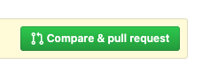
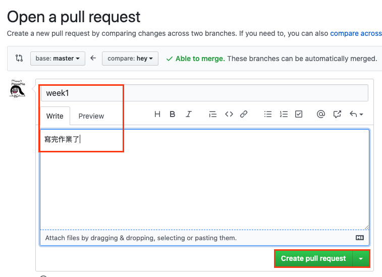

## 交作業流程

1. 新建一條 branch，並切換過去 `＄ git checkout -b <branchName>` 
2. 在相對應的資料夾寫作業、看完自我檢查後加入暫存區（Stage Area） `$ git commit -add '<fileName>'`
3. commit 到本地端檔案庫（local repo） `$ git commit -m '完成作業'`
4. 把 branch 推上遠端檔案庫（remote repo）`$ git push origin <branchName>`
5. 發出 pull request

6. 放 PR 連結至[作業列表](https://learning.lidemy.com/homeworks)
7. 回首頁按下完成按鈕(https://learning.lidemy.com/)
8. 待助教批改完作業後 merge ...
9. 將遠端檔案庫（remote repo）master 拉回本地端檔案庫（local repo） `$ git pull origin master`
10. 刪除本地端分支 `$ git barnch -d <branchName>`