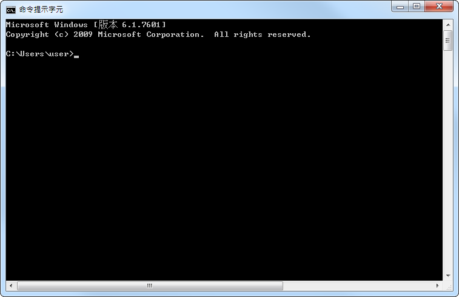

## 教你朋友 CLI

CLI 全名為：Commond Line Interface，中文是命令列介面。在說明 CIL 是什麼之前我們先來了解「GUI」。

GUI 全名為：Graphical  User Interface，中文是圖形使用者介面，我們現在幾乎都是用 GUL 來跟電腦溝通（進行操作），例如：新增檔案、新增資料夾、開啟軟體等等。利用滑鼠點擊的方式及圖形化就可以達到上述的操作，因此在沒有 GUI 之前，打開電腦就只會看到黑黑的介面，必須輸入一些指令電腦才知道你要幹嘛，h0w 哥不是常逛批踢踢嗎？ 批踢踢也算 CLI 的一種。




那就正式進行操作吧（環境： MAC）

1. **\[基本指令] 開啟終端機**
    * 在電腦裡搜尋： Terminal or 終端機。
    * 一開始會看到 `~` 代表著使用者底下的資料夾；如果是 `/` 代表電腦的根目錄。
    * 你可以使用 `$ pwd` 來知道當前的路徑

2. **\[基本指令] 誒你要在哪裡建立檔案啊？我先預設你要建立在桌面吧**
    * 切換目錄：`$ cd` 
    * 列出當前目錄底下的所以檔案：`$ ls` 
        * `$ ls -la` 列出「隱藏檔案」及「檔案詳細資訊」


    * 舉例： 移動到桌面並查看「隱藏檔案」及「檔案詳細資訊」
        ```
        $ cd Desktop/
        $ cd ls -la
        ```

3. **\[檔案操作指令] 新建檔案及資料夾**
    * 建立資料夾：`$ madir <folderName>` 
    * 新建檔案： `$ touch afu.js`
    * 舉例：建立一個叫做 wifi 的資料夾，並且在裡面建立一個叫 afu.js 的檔案
        ```
        $ mkdir wifi
        $ cd wifi
        $ touch afu.js
        ```
4. **\[檔案操作指令] 至於檔案要怎麼編輯**
   * 編輯檔案： `$ vim afu.js`
   * 會進入到一個 vim 的世界，跟 Terminal 用法不太一樣，你可能進去後會想「這三小」，所以我提供以下簡易操作說明  ：
        * 進入編輯狀態： `i`
        * 退出編輯狀態： `esc`
        * 退出： `:q`
        * 存檔後退出： `:wq`

如果你碰到其他問題可以看看我整理的文章：[[第一週] Command Line 基本指令與操作](https://medium.com/@miahsuwork/%E7%AC%AC%E4%B8%80%E9%80%B1-command-line-%E5%9F%BA%E6%9C%AC%E6%8C%87%E4%BB%A4%E8%88%87%E6%93%8D%E4%BD%9C-f4da8bcfdfa) 

