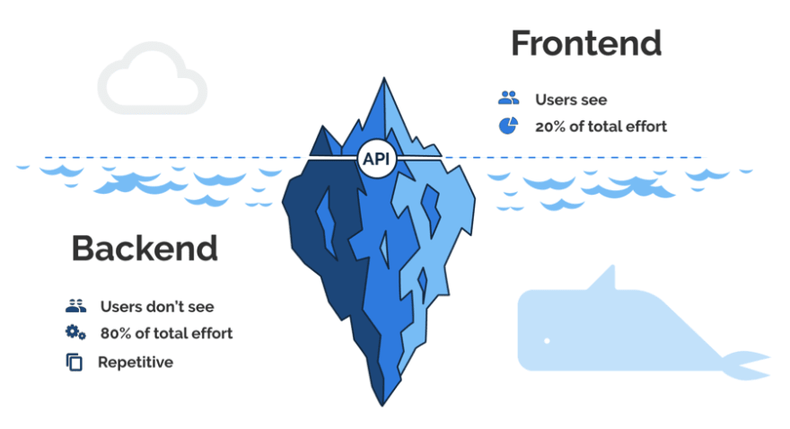

## 請解釋後端與前端的差異。

### 看得到的叫前端，看不到的叫後端

#### 前端

* 處理資料的呈現。
* 使用者介面互動。
* 網站效能調校。
* 確保網站最大化還原設計稿，各種載具體驗一致。

#### 後端

* 資料庫的串接設計。
* 處理伺服器效能。
* 網站效能調校。
* 應用程式介面（API）開發。

## 假設我今天去 Google 首頁搜尋框打上：JavaScrit 並且按下 Enter，請說出從這一刻開始到我看到搜尋結果為止發生在背後的事情。

1. DNS 將 url 解析成 IP 位置，
2. 瀏覽器(Client)將 IP 包成一個 Request 發送出去。
2. Request 透過 Internet 的層層協定 發送到 Server 端。
3. Server 端解析 Request 
4. 在 data center 撈取有關 JavaScript 的資料
5. 包成一個 Response 回傳。
4. Client 端開始解析 Response、解析 .html 檔案。
5. 根據 .html 的檔案內容，一旦發現有 CSS、JS 或 image 等檔案，再發送個檔案的 Request 。
6. Client 端發送完包含在 html 所有資源的 Request。
7. 開始下載資源（CSS、JS 或 image）。
8. 渲染網頁。

## 請列舉出 3 個「課程沒有提到」的 command line 指令並且說明功用

1. **less**
    * 以分頁的方式印出檔案內容
    * 寫法： `$ less <file>`
2. **open**
    * 開啟檔案
    * 寫法： `$ open <file>`
    * 變化型： 
        * 開啟當前目錄資料夾：`$ open .`
3. **tail**
    * 印出檔案的最後幾行
    * 寫法： `$ tail <file>`